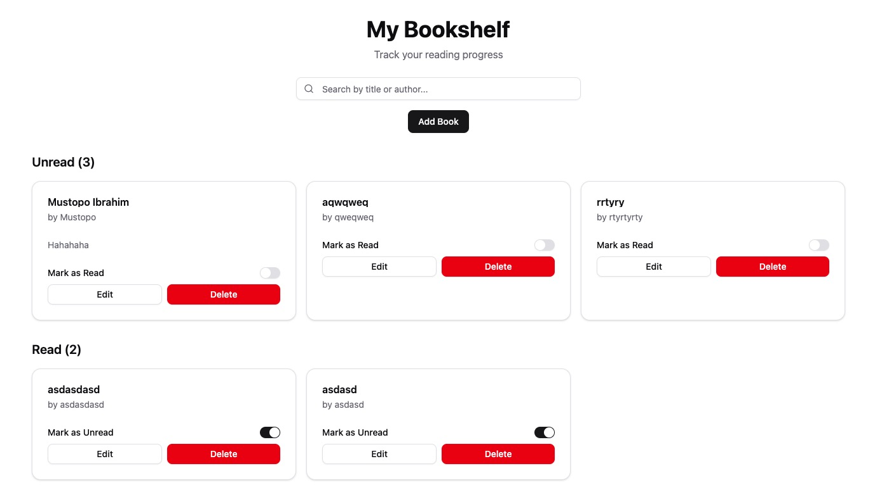

# Bookshelf App

A simple React-based bookshelf application to manage your reading lists with local storage persistence.



## Features

- **Dual Book Lists**: Organize books into "Read" and "Unread" sections
- **Book Management**: 
  - Add new books (default status: "Unread")
  - Toggle status between Read/Unread (moves between lists)
  - Edit book details (title, author, etc.)
  - Delete books from either list
- **Search Functionality**: Find books by title or author
- **Data Persistence**: Automatically saves/load books from local storage
- **Responsive Design**: Works on mobile and desktop devices
- **Modern UI**: Clean interface with shadcn/ui components

## Tech Stack

- [React](https://reactjs.org/) (Functional components with hooks)
- [TypeScript](https://www.typescriptlang.org/)
- [shadcn/ui](https://ui.shadcn.com/) for pre-built components
- [Tailwind CSS](https://tailwindcss.com/) for styling
- [Vite](https://vitejs.dev/) for fast development
- [Local Storage](https://developer.mozilla.org/en-US/docs/Web/API/Window/localStorage) for data persistence

## Getting Started

### Prerequisites

- Node.js (version 16 or higher)
- npm or yarn

### Installation

1. Clone the repository:
   ```bash
   git clone <repository-url>
   ```

2. Navigate to the project directory:
   ```bash
   cd bookshelf-app
   ```

3. Install dependencies:
   ```bash
   npm install
   ```
   or
   ```bash
   yarn install
   ```

### Development

To start the development server:

```bash
npm run dev
```
or
```bash
yarn dev
```

The application will be available at `http://localhost:5173` (or another port if 5173 is busy).

### Building for Production

To create a production build:

```bash
npm run build
```
or
```bash
yarn build
```

### Previewing Production Build

To preview the production build locally:

```bash
npm run preview
```
or
```bash
yarn preview
```

## Usage

1. Click "Add Book" to add a new book to your shelf (defaults to "Unread")
2. Toggle the status of a book between "Read" and "Unread" using the switch
3. Edit or delete books using the action buttons
4. Search for books by title or author using the search bar
5. All data is automatically saved to your browser's local storage

## Project Structure

```
src/
├── components/     # React components
├── lib/           # Utility functions
├── types.ts       # TypeScript types
├── App.tsx        # Main application component
└── main.tsx       # Application entry point
```

## Data Structure

Books are stored with the following structure:

```typescript
{
  id: string;
  title: string;
  author: string;
  status: 'read' | 'unread';
  coverImage?: string;
  description?: string;
}
```

## Contributing

Contributions are welcome! Please feel free to submit a Pull Request.

## License

This project is licensed under the MIT License.